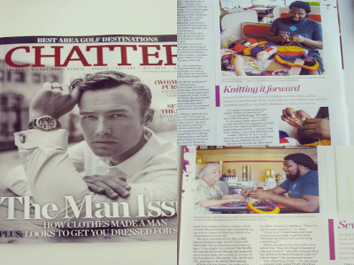

# Get Yo Craft On

This is a site that I'm putting together for the community of the city of Chattanooga to teach them how to knit and crochet at no cost.

The goal for this site is not to show off my skills as a developer. But to promote the health benefits that these classes offer which are:
   + Reduces chronic pain
   + Reduces anxiety
   + Reduces depression
   + Builds confidence
   + Lowers blood pressure
   + Helps those suffering from PTSD
   + Helps delay the onset of dementia.
   + Helps abuse victims
   + Gives a sense of purpose
   + Increases happiness
   + Creates a sense of accomplishment by doing something that you never thought you could.
   
I'm hoping that by the end of the year to bring the gift of crafting to at least #100 people. And over the next five years I plan on bringing at least over 1000 people via in person classes and possibly creating a social media prescence on sites like Facebook and Youtube.

The reason why this mission is so important to me is because I myself was a victim of mental, sexual, and physical abuse. I was also almost a victim of shooting on three different occasions and the third time the bullet was few inches from hitting me in the back of my head, but thankfully I moved out the way in time. I didn't end up in these situations because of anything that I did, but it was because I lived in some really rough areas of the city. And as a result of I suffer from PTSD. Also, when I was 15, I suffered a compound fracture in my right arm/hand and was not really able to use my right hand without experiencing severe pain. But thanks to crocheting and knitting I have more mobility than I previously had.

I also was someone who didn't have a lot of confidence in myself. But thanks to my friend Melanie Dobbs Gibbs, who taught me how to crochet 13 years ago when I was homeless, I'm now confident enough to not only craft anywhere, but I'm confident to teach these classes and give this awesome gift to others. 

Last month my friend Melanie and I were featured in _Chatter Magazine_ and I shared my story about how I became a passionate crafter: This page is no longer up but here's a photo of the article: 
 

If you or someone else you know are in the Chattanooga area and are interested in participating in my <strong> Get Yo Craft On </strong> workshops, DM on Instagram @danteknits. 

Be on the lookout. The site will be up soon.
